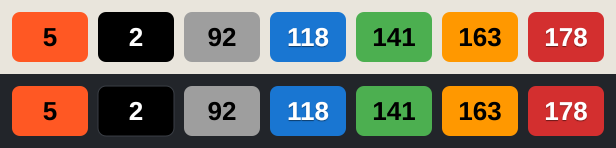
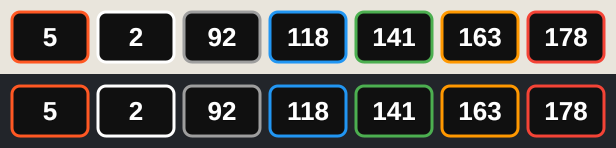
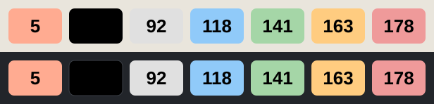
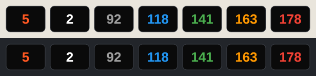

# Karoo AXS Ratio — Corner Overlay for Hammerhead Karoo

> **Stable 1.1.0** — install the APK from the [latest release](../../releases/latest).

A lightweight Hammerhead Karoo extension that draws small, always-visible metric
tiles in the four corners of the ride screen, on top of whatever page you are
viewing. It was born to keep the current **SRAM AXS rear gear** in sight at all
times, and grew to show a handful of other live ride metrics.

## What it shows

Each metric can be placed in one of the four corners (Top-left, Top-right,
Bottom-left, Bottom-right) or turned off. Picking a corner that is already taken
moves the previous metric to *Off*.

| Metric        | Notes |
|---------------|-------|
| **Gear**      | Current AXS rear gear/cog. Tile turns black for cogs ≥ 10. |
| **HR**        | Heart rate, with the tile colored by HR zone (see below). |
| **Power**     | Watts. |
| **Cadence**   | RPM. |
| **Speed**     | km/h. |
| **Grade**     | Elevation grade, signed (e.g. `+4%`). |
| **Temp**      | Temperature in °C. |
| **To next turn** | Distance to the next navigation turn (`m` / `k`). |

### HR zone colors

| Zone | Color  |
|------|--------|
| 1    | Grey   |
| 2    | Blue   |
| 3    | Green  |
| 4    | Orange |
| 5    | Red    |

## Tile styles

Four presets (Settings → **Appearance** → **Tile style**) control how the tiles
look. Every text/background pairing keeps a WCAG contrast ratio of **at least
4.5:1**, and light text gets a subtle shadow — so values stay readable even in
direct sunlight on the transflective display.

Each preview below shows the same tiles over a light map and a dark background.
Columns, left to right: default tile (gear 5), gear ≥ 10, then HR zones 1–5.

**Vivid** *(default)* — the classic colored tiles. HR zones 2 and 5 use darker
blue/red so the white text stays readable.



**Outline** — black tiles, white text at maximum contrast; the HR zone is shown
by the colored border. The best pick for direct sunlight.



**Pastel** — soft pastel zone backgrounds with black text: the quiet,
high-contrast option.



**Ink** — black tiles with the value drawn in the zone color.



Measured contrast ratios per tile (WCAG AA requires 4.5:1):

| Tile | Vivid | Outline | Pastel | Ink |
|---|---|---|---|---|
| Default (gear, power, …) | 6.7:1 | 19:1 | 11.5:1 | 6.7:1 |
| Gear ≥ 10 | 21:1 | 19:1 | 21:1 | 21:1 |
| HR zone 1 (grey) | 7.8:1 | 19:1 | 13.9:1 | 7.8:1 |
| HR zone 2 (blue) | 4.6:1 | 19:1 | 12.0:1 | 6.7:1 |
| HR zone 3 (green) | 7.6:1 | 19:1 | 12.8:1 | 7.6:1 |
| HR zone 4 (orange) | 9.7:1 | 19:1 | 14.2:1 | 9.7:1 |
| HR zone 5 (red) | 5.0:1 | 19:1 | 9.8:1 | 5.7:1 |

Switching style while **Preview** is running restarts the preview cycle, so you
can compare styles with all the HR zones simulated.

## What's new in 1.1

- **Four selectable tile styles** — Vivid, Outline, Pastel, Ink — under the new
  **Appearance** setting. Every pairing is WCAG AA compliant; this fixes the
  hard-to-read HR zone 2 (blue) and zone 5 (red) tiles reported on 1.0.
- Light text gets a subtle **shadow** for readability in direct sunlight.
- Switching style during **Preview** restarts the preview cycle.
- The overlay service **restarts automatically after an APK update** — no more
  opening the app (or rebooting) to bring the tiles back.

## What's new in 1.0

- First **stable** release.
- Tiles now hide while the **screen is off** (battery save mode).
- From 0.99: tiles are shown **only while a ride is recording** (never over
  system screens, hidden on pause; **Preview** still forces them visible), and
  opening the app restarts the overlay service after an APK update.

## Install

1. Download `KarooAxsRatio.apk` from the [latest release](../../releases/latest).
2. Sideload it onto the Karoo (e.g. `adb install -r KarooAxsRatio.apk`, or copy and
   open it on the device).
3. Open **AXS Ratio** from the app list.
4. Grant the **overlay** ("Display over other apps") permission when prompted.
5. Tap **Enable Overlay**, then assign each metric to a corner.
6. Use **Preview** to cycle through placed metrics and check positioning.

The overlay runs as a foreground service and re-starts on boot, so it stays up
across rides. Tiles are visible only while a ride is recording (or during
Preview), so they never get in the way on system screens.

> From 1.0.1 the APK is **release-signed**. Updating from 1.0 or any beta
> (debug-signed) requires a one-time uninstall/reinstall — overlay settings
> will need to be set again. It is not on the Hammerhead app store.

## Build from source

Requires JDK 17+ (the Android Studio bundled JBR works) and the Android SDK.

```bash
./gradlew assembleDebug
# output: app/build/outputs/apk/debug/app-debug.apk
```

Built against the [Hammerhead `karoo-ext`](https://github.com/hammerheadnav/karoo-ext)
SDK. `minSdk 23`, `targetSdk 34`.

## Status

Personal project, shared as-is. Feedback and issues welcome.

## License

MIT License — see [LICENSE](LICENSE) for details.
